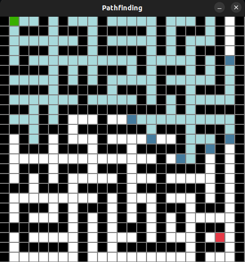

# Maze Generation and Pathfinding Simulator

#### Requirements:

- Python3
- Pygame

#### Use:

- Run pathfinding.py with one of the following arguments:
  - `python3 pathfinding.py bfs`
  - `python3 pathfinding.py dfs`
  - `python3 pathfinding.py greedy`
  - `python3 pathfinding.py a*`
- Set the starting node by left clicking one of the white boxes
- Set the ending node by right clicking one of the white boxes
- Add walls (black boxes) by holding and dragging left click
- Remove walls by holding and dragging right click
- Hit space key to start the algorithm
- Hit tab to reset board

